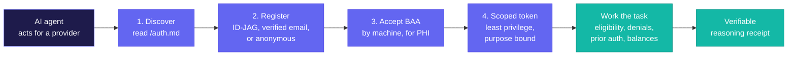
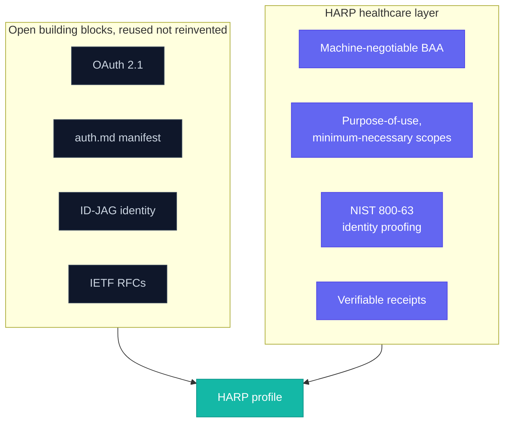
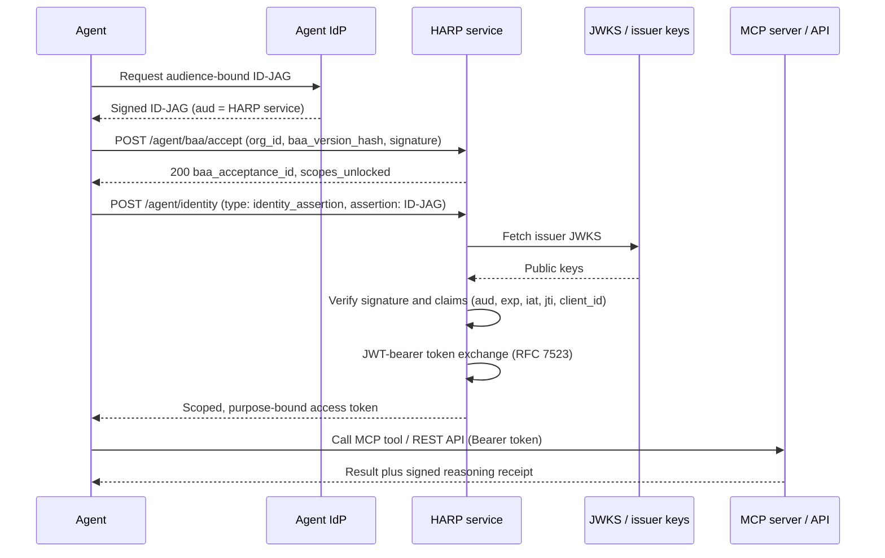

# HARP: Healthcare Agent Registration and Connection Profile

### Created and architected by Ric S Kolluri, Founder and CIO of Neomics

- **Author and architect:** Ric S Kolluri, Founder and CIO, Neomics
- **Version:** 0.1.3 (draft; the wire-level profile version is 0.1)
- **CI:** [](https://github.com/rico2035/harp-spec/actions/workflows/ci.yml)
- **Status:** Open standard, published for public review and adoption
- **License:** MIT with an attribution requirement. Adopters must credit HARP and its author, Ric S Kolluri (Neomics). See [LICENSE](LICENSE).

HARP was designed to be vendor-neutral, with a committed path to donate to a neutral standards body (HL7, the Linux Foundation, or the NIST AI Agent Standards Initiative) once adoption thresholds are met.

> HARP does for healthcare agent access what auth.md does for the rest of the web. It is a thin, open profile. An AI agent can find a service, register, prove who it works for, and get going, with no human filling out a form. HARP adds the pieces a service that touches PHI needs and that the base specs leave out.

---

## What HARP does at a glance

An AI agent discovers a service, registers without a human, accepts a Business Associate Agreement by machine when it needs PHI, receives a scoped and purpose-bound token, does the work, and leaves a verifiable receipt behind.



HARP composes stable, open standards and adds only the parts a PHI-handling service needs.



---

## Why HARP exists

Agents are becoming real users of software. They write code, open tickets, query systems, and update records. In healthcare revenue operations they can check eligibility, work denials, draft appeals, post payments, and follow up on balances. The problem: almost no healthcare system has a way to let an agent in. The workaround is a raw API key, which is unscoped, hard to audit per session, and impossible to revoke selectively. That is unacceptable for protected health information (PHI).

The generic web already has an answer to agent registration in **auth.md** (WorkOS, MIT), built on standard OAuth. auth.md solves one thing well: present an identity, receive a scoped credential. It stops there on purpose. It says nothing about a Business Associate Agreement, identity-proofing strength, minimum-necessary scoping, audit obligations, delegation, autonomy limits, or verifiable decisions.

HARP fills that gap. It is a **profile**, not a fork. A generic auth.md agent still registers and works. A healthcare-aware agent gets the safe, purpose-bound path it needs.

---

## Design principles

1. **Compose, do not reinvent.** HARP builds on existing, stable standards. It adds healthcare fields, not a new protocol.
2. **Open and free to adopt.** Any service can publish HARP. Any agent can read it. No account with Neomics or anyone else is required.
3. **Least privilege by default.** Scopes are bound to a purpose of use and the minimum data needed. PHI is gated behind a stronger bar than de-identified data.
4. **Every decision leaves proof.** Any action that matters can produce a signed receipt. A third party can check it without trusting whoever issued it.
5. **One path for agents and people.** An agent registers through a single flow with errors that explain themselves. A person can claim, supervise, and override through the same actions.

---

## What HARP builds on

| Layer | Standard | Role in HARP |
|---|---|---|
| Resource discovery | Protected Resource Metadata, RFC 9728 | Find the auth server and scopes from a `WWW-Authenticate` header or `/.well-known/oauth-protected-resource` |
| Registration manifest | auth.md (MIT) | The `/auth.md` skill manifest and the `agent_auth` metadata block |
| Identity assertion | ID-JAG (`urn:ietf:params:oauth:token-type:id-jag`) | An agent's provider attests to the user it acts for |
| Token exchange | JWT Bearer, RFC 7523; Token Exchange, RFC 8693 | Exchange an assertion for a scoped access token; carry delegation |
| Claim ceremony | Device Authorization, RFC 8628 | A human claims an agent-created account |
| Revocation | Token Revocation, RFC 7009; Security Event Tokens, RFC 8935 | Revoke credentials and signal registration-layer events |

---

## The `/auth.md` file

HARP services publish a Markdown manifest at `https://service.example.com/auth.md`. It is a procedural recipe an agent can follow: **discover, pick a method, register, claim, exchange, use, handle errors, revoke.** HARP adds two sections to the base auth.md outline: **Compliance (BAA)** and **Receipts.**

## The `agent_auth` metadata block

Carried in the OAuth authorization-server metadata. Base auth.md fields plus the HARP healthcare extension:

```jsonc
{
  "agent_auth": {
    "skill": "https://service.example.com/auth.md",
    "identity_endpoint": "https://auth.service.example.com/agent/identity",
    "claim_endpoint": "https://auth.service.example.com/agent/identity/claim",
    "events_endpoint": "https://auth.service.example.com/agent/event/notify",
    "identity_types_supported": ["anonymous", "identity_assertion", "service_auth"],
    "identity_assertion": {
      "assertion_types_supported": ["urn:ietf:params:oauth:token-type:id-jag"]
    },
    "events_supported": [
      "https://schemas.harp-standard.org/events/identity/assertion/revoked"
    ],

    // ---- HARP healthcare extension ----
    "harp": {
      "version": "0.1",
      "baa": {
        "required_for_phi": true,
        "terms_uri": "https://service.example.com/legal/baa",
        "accept_endpoint": "https://auth.service.example.com/agent/baa/accept",
        "version_hash": "sha256:..."
      },
      "identity_proofing": {
        // NIST SP 800-63-4 levels required per scope tier. Under revision 4,
        // the deidentified tier means: no identity proofing required, AAL1
        // authentication. (An eIDAS expression of these tiers is proposed in
        // RFC 0001 for EU deployments.)
        "deidentified": { "ial": 1, "aal": 1 },
        "phi_read":     { "ial": 2, "aal": 2 },
        "phi_write":    { "ial": 2, "aal": 2 }
      },
      "purpose_of_use_supported": ["TREATMENT", "PAYMENT", "HEALTHCARE_OPERATIONS"],
      "scopes": [
        { "name": "rcm.eligibility:read", "purpose": "PAYMENT", "phi": true,  "min_necessary": "coverage" },
        { "name": "rcm.claims:read",       "purpose": "PAYMENT", "phi": true,  "min_necessary": "claim" },
        { "name": "rcm.claims:write",      "purpose": "PAYMENT", "phi": true,  "min_necessary": "claim" },
        { "name": "rcm.denials:work",      "purpose": "PAYMENT", "phi": true,  "min_necessary": "claim,clinical_excerpt" },
        { "name": "rcm.collections:negotiate", "purpose": "PAYMENT", "phi": true, "min_necessary": "balance" }
      ],
      "autonomy": {
        // What the service will do without a human, and what it gates
        "auto": ["rcm.eligibility:read", "rcm.claims:read", "rcm.denials:work"],
        "human_review_required": ["medical_necessity_denial"],
        "note": "Human-review actions follow applicable state law and tenant policy."
      },
      "delegation": {
        "chain_required": true,
        "claims": ["act"],
        "format": "rfc8693"
      },
      "payment_mandates_supported": ["ap2", "stripe-acp", "x402"],
      "receipts": {
        "supported": true,
        "format_uri": "https://schemas.harp-standard.org/receipt/0.1",
        "verify_uri": "https://service.example.com/agent/receipt/verify"
      },
      "free_tier": {
        "scopes": ["rcm.eligibility:read"],
        "data": "synthetic_or_deidentified",
        "rate_limit": "100/day"
      }
    }
  }
}
```

---

## Registration flows

HARP supports the three base flows. PHI scopes additionally require a completed BAA acceptance.



1. **identity_assertion (ID-JAG).** The agent obtains an audience-specific ID-JAG from its provider and `POST`s `{ "type": "identity_assertion", "assertion": "<ID-JAG>" }` to `identity_endpoint`. The service verifies the issuer via JWKS and validates `aud`, `exp`, `iat`, `jti`, `client_id`, then mints a scoped token through JWT-bearer exchange. Synchronous, no human.
2. **service_auth (verified email).** The agent posts `{ "type": "service_auth", "login_hint": "<email>" }`, receives a claim token and user code, the user verifies at a `verification_uri`, and the agent polls the token endpoint until granted.
3. **anonymous (deferred ownership).** The agent posts `{ "type": "anonymous" }`, receives a pre-claim token limited to the free tier, and a human later claims the account via `claim_endpoint`.

### The BAA handshake (HARP addition)

Before any PHI scope is issued, the agent's controlling organization accepts the BAA programmatically:

```
POST /agent/baa/accept
{ "org_id": "...", "baa_version_hash": "sha256:...", "accepted_by": "...", "signature": "..." }
→ 200 { "baa_acceptance_id": "...", "scopes_unlocked": ["rcm.eligibility:read", ...] }
```

The acceptance is recorded as a signed, append-only event. PHI scopes remain unobtainable until it completes. To our knowledge, making BAA acceptance part of the machine registration handshake is new.

Two conditions make the handshake legally meaningful, and both are the deploying parties' responsibility: the document at `terms_uri` must be a complete BAA containing the provisions 45 CFR 164.504(e)(2) requires, and `accepted_by` must be a person with authority to bind the controlling organization, identity-proofed at the service's `phi_write` tier or above. The agent cannot accept a BAA for its organization. See `COMPLIANCE.md` for the full mapping.

---

## Verifiable Reasoning Receipts

For any consequential action, a HARP service can emit a signed receipt:

```jsonc
{
  "receipt_id": "...",
  "action": "denial.appeal.submitted",
  "actor": { "agent_id": "...", "delegation_chain": ["org", "workforce_member", "agent"] },
  "purpose_of_use": "PAYMENT",
  "inputs_digest": "sha256:...",          // hash of inputs, not the PHI itself
  "policy_applied": "policy:rcm/denials@v3",
  "model": "rcm-reasoner@2026.06",
  "evidence": [ { "source": "payer-policy:...", "ref": "..." } ],
  "conclusion": "...",
  "issued_at": "...",
  "signature": "..."
}
```

Anyone holding the receipt can verify the signature and the policy/version at `verify_uri` without trusting the issuer. Receipts and audit events must not contain direct identifiers or clinical content: they carry pseudonymous subject references and digests only, with any resolution mapping held separately by the controlling organization. This keeps the append-only chain intact while erasure obligations (such as GDPR Art. 17) are satisfiable by deleting the mapping.

All HARP flows (discovery, registration, agreement acceptance, token exchange, resource calls, receipt verification) require TLS 1.2 or later. A service must not serve any HARP endpoint over plaintext HTTP outside local development.

---

## Conformance

A service is **HARP-compliant** if it meets the conformance criteria described in `CONFORMANCE.md`: hosts a valid `/auth.md` and `agent_auth` block, supports the three flows, enforces the BAA gate for PHI scopes, issues purpose-bound least-privilege tokens, and (for the receipts tier) emits verifiable receipts. Conformance is self-serve and verifiable. A runnable conformance suite ships in `/conformance` (v0.1, intentionally minimal and growing through the RFC process): point it at your service with `node runner.mjs <base-url>`. Passing services may display the HARP-compliant badge.

---

## Repository layout

```
README.md      the specification (this document)
EXPLAINER.md   one-page overview for healthcare leaders
QUICKSTART.md  two-track implementation guide
COMPLIANCE.md  informative mapping to HIPAA, GDPR, EHDS, eIDAS, and the EU AI Act
/schemas       JSON Schemas for agent_auth, scopes, receipts, BAA events
/reference     a minimal runnable HARP-compliant server
/sdks          TypeScript client + server SDK (Python planned)
/examples      end-to-end samples (eligibility, registration, receipts)
/diagrams      sequence and architecture diagrams
/rfcs          the RFC process and templates
/conformance   runnable public test suite + badge (v0.1; see CONFORMANCE.md)
GOVERNANCE.md  open governance + RFC process + donation commitment
CONTRIBUTING.md, CODE_OF_CONDUCT.md, MAINTAINERS.md, CHANGELOG.md, LICENSE
```

## Connect to Neomics (reference implementation)

Point your agent at `https://api.goneomics.com/auth.md`, register (anonymous to try, ID-JAG plus BAA for PHI), receive a purpose-bound token, call the Neomics MCP server or REST API, and read your receipts. A hosted sandbox with synthetic data lets you try the full flow with no contract and no PHI.

---

## Status and how to contribute

HARP 0.1 is a draft published for review. Open an issue or RFC in this repository. The governance document describes how decisions are made and the path to a neutral standards body. The goal is a standard the whole industry owns, with Neomics as the first and most complete implementation.
