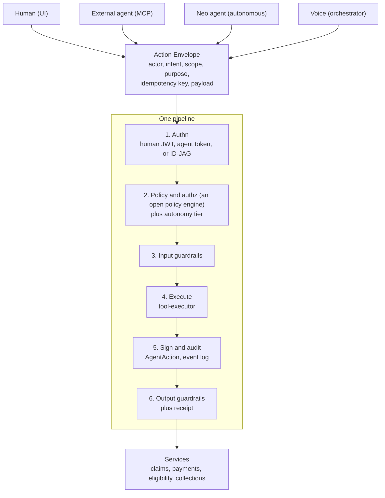

# Universal Action Layer

The keystone of the agent-native platform. Every actor (a human in the dashboard, an external agent over MCP, a Neo agent acting on its own, a voice call) executes the same typed Actions through one command bus. The UI, the MCP server, and the public API are thin adapters that translate a request into one Action Envelope, which runs through a single pipeline before it reaches any service. There is no path to an effect that bypasses authn, policy, guardrails, or signed audit.

