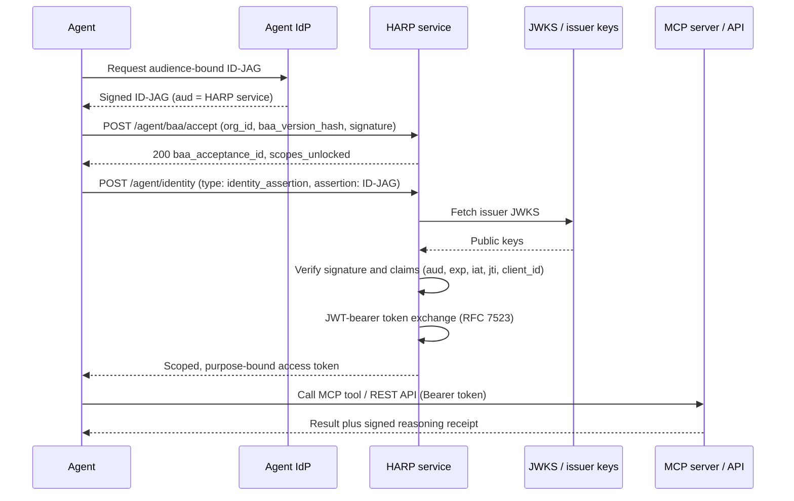

# HARP Registration Sequence

How an agent registers and gets a scoped, purpose-bound token with no human filling a form. The agent obtains an audience-bound ID-JAG from its own identity provider, accepts the Business Associate Agreement programmatically to unlock PHI scopes, then posts the assertion to the HARP service, which verifies it against the issuer JWKS and exchanges it for a least-privilege token. Every PHI scope stays locked until the BAA acceptance completes.

