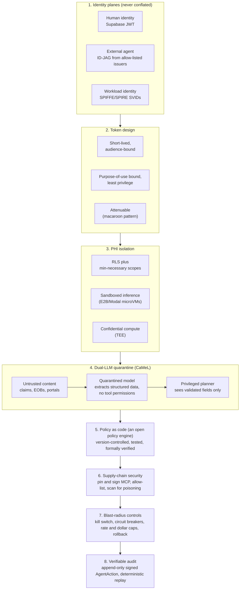

# Security Layers

Defense-in-depth for an autonomous workforce that touches PHI. Each layer assumes the others can fail: three identity planes that are never conflated, tokens that are short-lived and attenuable, PHI isolated down to confidential compute, a dual-LLM quarantine that keeps untrusted content away from any model holding tool permissions, policy as verifiable code, supply-chain controls on MCP, blast-radius limits, and a signed, replayable audit.

