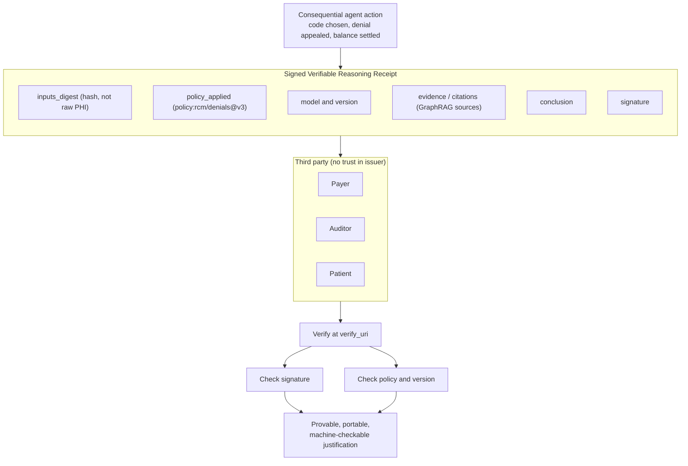

# Receipt Verification

Every consequential agent decision emits a signed Verifiable Reasoning Receipt: the inputs digest, the policy applied, the model and version, the evidence and citations, the conclusion, and a signature. A payer, auditor, or patient can verify the signature and the policy at the verify URI without trusting Neomics. The receipt references digests, never raw PHI, so justification is provable, portable, and machine-checkable.

